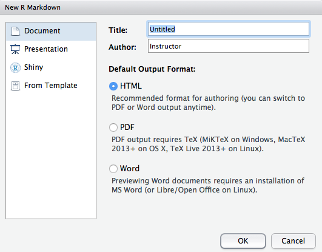
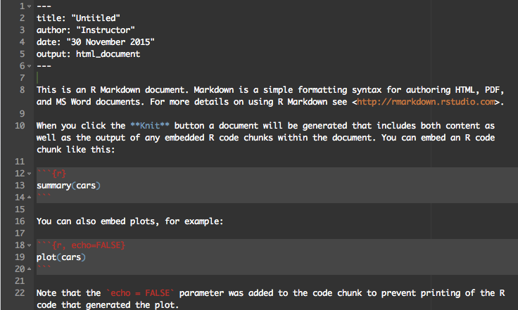
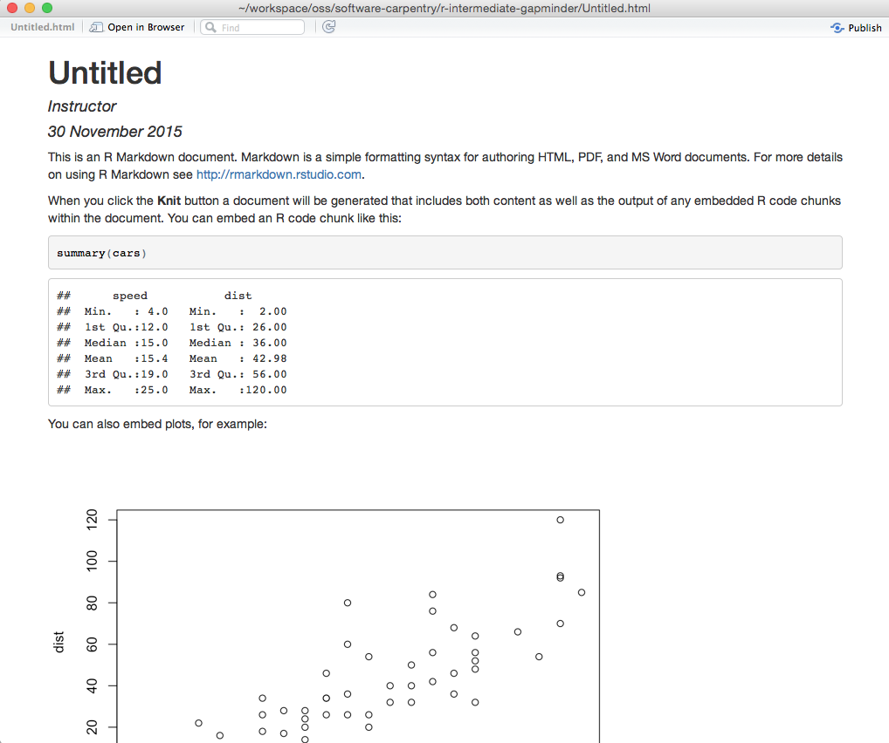

```{r, include=FALSE}
source("tools/chunk-options.R")
opts_chunk$set(fig.path = "fig/18-rmd-")
# Silently load in the data so the rest of the lesson works
gapminder <- read.csv("data/gapminder-FiveYearData.csv", header=TRUE)
```

> ## Learning objectives {.objectives}
>
> * To be able to create html pages, word, and PDF documents with embedded R 
>   code and figures.
>

RStudio makes it easy to create documents with both text and R code. Let's try
it out!

In RStudio, go to the "File" menu, then select "New File", then select 
"R Markdown...". The following window should pop up:



Selecting the "HTML", "PDF", or "Word" options changes the type of document that
you will finally generate.

For now we'll select "HTML".

A new file should open in the RStudio Source editing pane that looks like this:



R markdown documents have three types of content. R code, which is written in 
blocks surrounded by three back ticks: \`\`\`. A YAML header at the top of the 
page containing details about the document such as the title, author and date,
and plain text. These control how the final document will appear. Lets test it 
out!

Above the source pane you should see a ball of yarn labelled "Knit HTML". Press
it!

Some code should run in the R console and a new window should open:



In the HTML document, you can see the header information has been turned into
a large title. You should see the first code block, as well as the output it 
generates if you were to run it in R! The second code block has been hidden,
and the plot it generates has been embedded in the document.

The plain text has been rendered using a lightweight syntax called "markdown".
This allows you to apply formatting to the plain text. For example wrapping a 
word with two stars: \*\*makes bold text\*\* in the final document!

RStudio provides a [handy cheat sheet][1] containing the formatting syntax as well
as options for modifying the way R code is run inside the code blocks.

[1]: https://www.rstudio.com/wp-content/uploads/2015/02/rmarkdown-cheatsheet.pdf

> #### Challenge 1 {.challenge}
>
> Write a sentence containing words with bold, italics, and underlined formatting.
>

> #### Challenge 2 {.challenge}
>
> In a plain text section, create a link to the Software Carpentry website 
> (http://software-carpentry.org/)
>

> #### Challenge 3 {.challenge}
>
> Change the size of the plot generated by the second code block to be 3 inches
> wide and 5 inches high (hint, you will need to add options to the `{r}` at 
> the top of the code block!) 
>

> #### Challenge 4 {.challenge}
>
> Add a new code block that reads in the gapminder data, and prints out the 
> total GDP for each continent in 1977
>


> #### Caching slow code {.callout}
>
> Sometimes our analyses can take minutes, hours, or even days to run! Waiting
> for this code to run every time we generate the final document from R markdown
> would be impossible. To avoid this, add the option `cache=TRUE` to the start
> of your code block (e.g. `{r, cache=TRUE}` instead of `{r}`). 
>

> #### Scientific references {.callout}
>
> R markdown can also handle reference management. See [this guide](http://rmarkdown.rstudio.com/authoring_bibliographies_and_citations.html).
>
