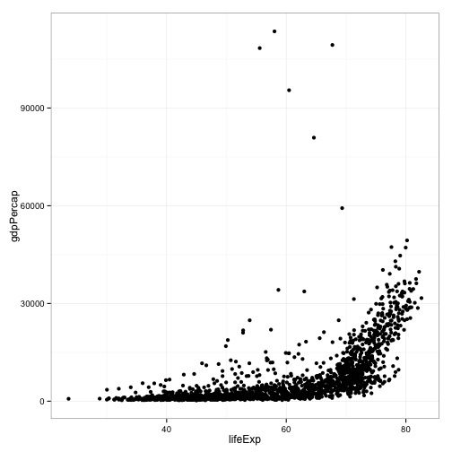
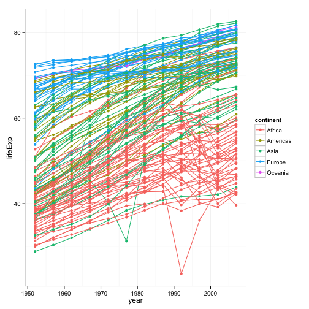

> ### Learning Objectives {.objectives}
>
> * To get a taste of R's powerful visualisation capabilities
> * To get a taste of R's powerful statistical analysis capabilities
> * To show how interweaving those capabilities pays off
>

### Introduction to R

Welcome to the R portion of the Software Carpentry workshop. We're going to show you how R and RStudio can help you understand large data sets. We'll also guide your first steps towards using them effectively for your own work.

> ### Installation
> * Download RStudio from [http://www.rstudio.com/products/rstudio/download/](http://www.rstudio.com/products/rstudio/download/)
> * (Download gapminder data -- can we include in this repo?}
> * Once you've got RStudio installed, open it.
> * In the interactive console (left tab), type:
> * > install.packages('ggplot2', 'dplyr', 'tidyr')
> * and hit return, which will tell RStudio to find and install packages that we're going to use.
> * (what else?)

We're going to start with a simple but powerful example of how R can help you visualize, manipulate, and analyze data. In the interactive console, enter each command. Later lessons will go more deeply into what they do and how to effectively leverage R and its packages.

Let's start  by loading a data set and seeing how big it is.

~~~{.r}
gapminder <- read.csv("data/gapminder-FiveYearData.csv", header=TRUE, sep=',')
nrow(gapminder)
~~~

~~~{.output}
[1] 1704

~~~

1,704 entries: that's too many to understand by reading. Let's look at the first few entries to get a better sense of what we have:

~~~{.r}
head(gapminder)
~~~

~~~{.output}
      country year      pop continent lifeExp gdpPercap
1 Afghanistan 1952  8425333      Asia  28.801  779.4453
2 Afghanistan 1957  9240934      Asia  30.332  820.8530
3 Afghanistan 1962 10267083      Asia  31.997  853.1007
4 Afghanistan 1967 11537966      Asia  34.020  836.1971
5 Afghanistan 1972 13079460      Asia  36.088  739.9811
6 Afghanistan 1977 14880372      Asia  38.438  786.1134

~~~

Interesting: the data concerns countries, years, "pop", "lifeExp", and "gdpPercap". (The person who created the data set choose those abbreviations for "Population", "Life Expectancy", and "GDP per Capita," respectively.) Let's see if we can get a better handle on it by visualizing it. Load the `ggplot2` plotting package and construct a scatter plot.

~~~{.r}
library(ggplot2)
ggplot(data = gapminder, aes(x = lifeExp, y = gdpPercap)) +
  geom_point()
~~~

In the lower right panel, you should see a graph that RStudio produced in response to your command. What can you tell about this data set from this initial graph?

This first graph suggests a relationship between life expectancy and GDP per capita. Another relationship we might be interested in is the change in life expectancy over time by country and continent.

~~~{.r}
ggplot(data = gapminder, aes(x = year, y = lifeExp, by = country, colour = continent)) +
  geom_line() +
  geom_point()
~~~

The plots above are great for visualizing data, but what if we want to figure out something quantitative about the relationships and patterns we observed? R gives you flexible and powerful tools to do manipulation and computation on your data.

Let's use the `dplyr` package to find the pairwise correlations between life expectancy, GDP per capita, and population.

~~~{.r}
library(dplyr)
cors <- gapminder %>%
  group_by(year) %>%
  summarise(gdpPercap.lifeExp = cor(gdpPercap, lifeExp),
            gdpPercap.pop = cor(gdpPercap, pop),
            pop.lifeExp = cor(pop, lifeExp))
head(cors)
~~~

~~~{.output}
Source: local data frame [6 x 4]

   year gdpPercap.lifeExp gdpPercap.pop  pop.lifeExp
  (int)             (dbl)         (dbl)        (dbl)
1  1952         0.2780236   -0.02526041 -0.002724782
2  1957         0.3037445   -0.02807342  0.014492716
3  1962         0.3832211   -0.03165089 -0.031299202
4  1967         0.4801398   -0.03795448  0.032447402
5  1972         0.4597014   -0.04367936  0.046951951
6  1977         0.6198638   -0.05587981  0.042456753

~~~

This is interesting, but it's now in a form that's hard to give to ggplot. We can use the `tidyr` package to put the data into tidy form.

~~~{.r}
library(tidyr)
~~~

~~~{.output}
Error in library(tidyr): there is no package called 'tidyr'

~~~

~~~{.r}
tidy.cors <- cors %>%
  gather(variables, correlation, gdpPercap.lifeExp, gdpPercap.pop, pop.lifeExp)
~~~

~~~{.output}
Error in function_list[[k]](value): could not find function "gather"

~~~

~~~{.r}
head(tidy.cors)
~~~

~~~{.output}
Error in head(tidy.cors): object 'tidy.cors' not found

~~~

Now we can visualize all of these relationships on one plot, and see how the correlations between all these variables change over time.

~~~{.r}
ggplot(tidy.cors, aes(x = year, y = correlation, colour = variables)) +
  geom_point() +
  geom_line() +
  theme_bw()
~~~

~~~{.output}
Error in ggplot(tidy.cors, aes(x = year, y = correlation, colour = variables)): object 'tidy.cors' not found

~~~

Just a few minutes with R, and we have learned that our data set contains a string and interesting relationship between GDP per capita and life expectancy.

Now let's dig into the details of using R.
